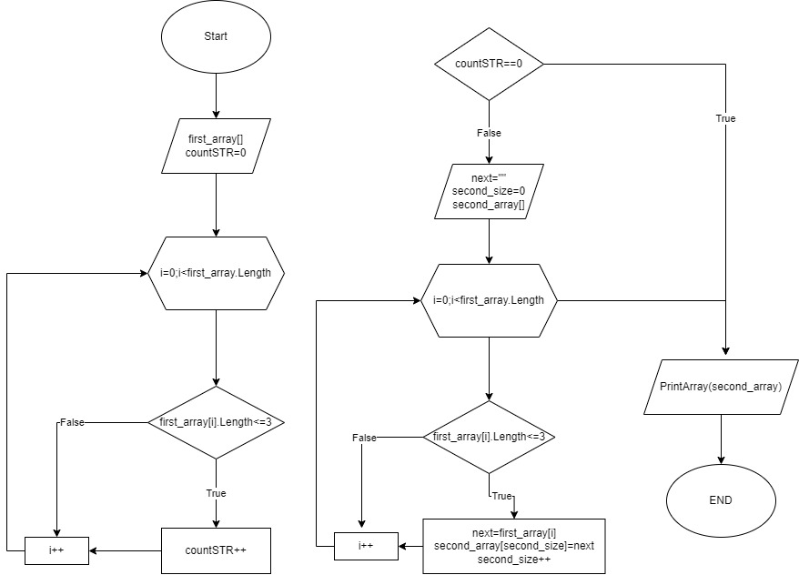

# Контрольная работа №1 Иванов Илья Владиславович
### Алгоритм

**_Описание задачи:_**
### *Написать программу, которая из имеющегося массива строк формирует массив из строк, длина которых меньше либо равна 3 символа. Первоначальный массив можно ввести с клавиатуры, либо задать на старте выполнения алгоритма. При решении не рекомендуется пользоваться коллекциями, лучше обойтись исключительно массивами.*

* Для решения необходимо посчитать при помои цикла, колличество элементов с длинной строки менее или равно 3 символа.
* Оценить наличие таких элементов.
* Создать новый массив, записав в него все полученные значения менее или равные 3.
* Функция (метод) для печати.